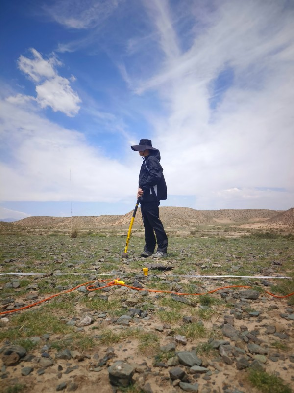

  

<h1 align="center">Shubin Wei</h1>

📧 <a href="mailto:weishb3@mail2.sysu.edu.cn">weishb3@mail2.sysu.edu.cn</a>  
🌐 <a href="https://github.com/Wei-Shubin">GitHub</a>

---

## Navigation
- [Education](#education)
- [Research-Interests](#research-interests)
- [Skills](#skills)
- [Research-Experience](#research-experience)
- [Awards](#awards)
- [Publications](#publications)

---

## Education
- **Sun Yat-sen University (SYSU)**  
  B.S. in Geophysics, School of Earth Sciences and Engineering

## Research Interests
- Deep Learning for Geophysical Applications  
- Ambient Noise Cross-correlation and Surface Wave Dispersion  
- Computational Seismology  

## Skills
- Programming: **C++**, **Python**, **MATLAB**  
- Tools: Git, Linux, LaTeX  

## Research Experience
- **Provincial Innovation Project**  
  Deep Learning-based Earthquake and Tsunami Hazard Prediction  

## Awards
- None yet  

## Publications
- None yet  
