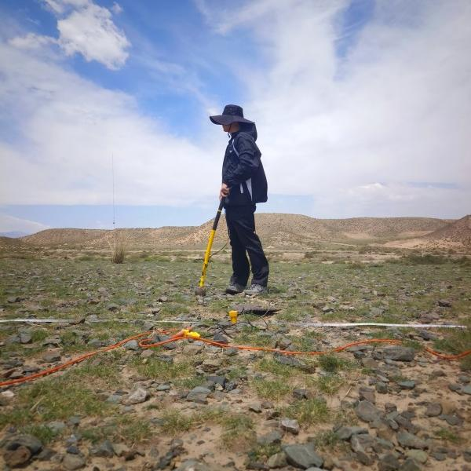

# Shubin Wei

📧 [weishb3@mail2.sysu.edu.cn](mailto:weishb3@mail2.sysu.edu.cn)  
🌐 [GitHub](https://github.com/Wei-Shubin)

---

## Education
- **Sun Yat-sen University**, B.S. in Geophysics

## Research Interests
- Deep Learning  
- Ambient Noise Cross-correlation  
- Computational Geophysics  

## Skills
- C++, Python, MATLAB

## Research Experience
- Provincial Innovation Project: Deep Learning-based Earthquake and Tsunami Hazard Prediction

## Awards
- None yet

## Publications
- None yet
